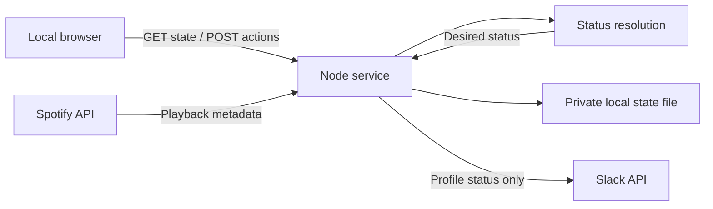

# NowVibing architecture

NowVibing is a single-user, local Spotify-to-Slack status application. The browser edits preferences and shows results. A Node process polls Spotify and updates Slack even when the browser is closed. No app-owned cloud service, hosted database, webhooks, or message-sending integration is involved.

## Components and responsibilities

| Path                                  | Responsibility                                                                                                                                                                                                                   |
| ------------------------------------- | -------------------------------------------------------------------------------------------------------------------------------------------------------------------------------------------------------------------------------- |
| `app/page.tsx`                        | Dashboard, connection dialogs, custom status editor, playlist rules, preferences, error feedback, and five-second polling of the local state API.                                                                                |
| `app/layout.tsx`                      | Document title, description, fonts, and dark theme.                                                                                                                                                                              |
| `app/globals.css`                     | Theme tokens, responsive layouts, component presentation, focus states, and reduced-motion behavior.                                                                                                                             |
| `components/ui/`                      | Generated Shadcn/Base UI primitives. The app uses dialog, select, switch, progress, and their dependencies. Other generated primitives remain available; application lint is scoped separately from this vendor-derived catalog. |
| `lib/utils.ts`, `hooks/use-mobile.ts` | Shared class-name helper and generated responsive hook.                                                                                                                                                                          |
| `server/engine.mjs`                   | Pure status priority, playlist ID parsing, text truncation, and playback normalization. No network or persistence.                                                                                                               |
| `server/service.mjs`                  | Connection state, API actions, provider calls, PKCE, token renewal, polling, publishing, rate limits, and the serialized work queue.                                                                                             |
| `server/provider-validation.mjs`      | Token/lifetime validation, safe provider error codes, retry delays, and browser URL filtering.                                                                                                                                   |
| `server/state-store.mjs`              | Private file storage, ownership/link checks, bounded state, and atomic replacement.                                                                                                                                              |
| `server/http.mjs`                     | Production HTTP boundary, byte-bounded JSON reader, URL validation, public-file confinement, and security headers.                                                                                                               |
| `server/start.mjs`                    | Production startup, loopback listener, request timeouts, and shutdown.                                                                                                                                                           |
| `vite.config.ts`                      | Development server and the same local API service. Private data changes are excluded from file watching.                                                                                                                         |
| `next.config.ts`                      | Static export configuration. The exported frontend is served by the Node server, not a hosted Worker.                                                                                                                            |
| `public/favicon.svg`                  | Local brand icon. Spotify supplies actual playback artwork at runtime.                                                                                                                                                           |
| `slack-manifest.json`                 | Optional Slack app creation template with only the required user scope.                                                                                                                                                          |
| `tests/`                              | Offline regression tests using temporary directories and mocked provider responses.                                                                                                                                              |
| `scripts/`, `.githooks/`              | Indexed-file credential checks and the local pre-commit hook.                                                                                                                                                                    |
| `.openai/hosting.json`                | Retained empty scaffold metadata. No hosted project ID or storage bindings are configured.                                                                                                                                       |
| `.local/`                             | Ignored runtime data. Never commit, deploy, or serve this directory.                                                                                                                                                             |

## Data flow

The page polls `/api/state` every five seconds. That request reads local memory; it does not call Spotify or Slack. The Node service checks playback every 15 seconds while automatic sync is enabled. It sends changes to Slack and renews expiring automated statuses once a minute. Status writes are separated by at least 6.5 seconds and respect provider backoff.

Provider requests time out after 12 seconds. A queue serializes mutations, authorization completion, and polling so two refresh operations do not reuse the same rotating Slack refresh token. The polling guard skips a new tick while one is already running. This is process-local coordination, not a distributed lock.

## Status priority

1. An unexpired custom status takes priority, even if music is paused or Spotify is disconnected.
2. A playlist rule matches the active Spotify context's playlist ID.
3. A playing track supplies the configured format (`{track}`, `{artist}`, `{album}`).
4. Otherwise use the idle fallback or an empty status.

Private sessions and advertisements do not produce playback metadata. Data older than a minute is not used to resolve a music status. A network error therefore stops extending stale music after the freshness window. Spotify URLs are restricted to HTTPS on `open.spotify.com`; artwork must be an HTTPS URL without embedded credentials.

Manual statuses expire after 30, 60, or 240 minutes, or remain until cleared. Automatic statuses expire on Slack after two minutes unless renewed. Clearing a manual status resumes normal priority resolution. An initial empty idle state does not erase a Slack status that predates the connection. Once connected and syncing, NowVibing owns status updates and does not restore statuses written by other clients.

The local desired status and the last successfully published status are distinct. `PREVIEW` means the current desired state has not been confirmed. `SYNCED` requires a successful matching write, enabled sync, and no current provider error. The history records successful status changes; heartbeat renewals are deduplicated.

## Spotify authorization

- Client ID is public configuration; no client secret is used.
- Authorization uses PKCE/S256 and requests only `user-read-playback-state`.
- Callback: `http://127.0.0.1:3000/api/auth/spotify/callback`.
- Random state is stored in process memory and an HttpOnly, SameSite=Lax cookie.
- Authorization state lasts ten minutes and is consumed before token exchange.
- Access tokens refresh before expiry. Rotated refresh tokens replace previous ones when returned.
- A 401 triggers one refresh-and-retry. Invalid authorization requires reconnecting. Refresh and playback 429 responses honor backoff.

## Slack authorization

The preferred connection is a PKCE-enabled Slack app with the `users.profile:write` **user** scope. The optional manually pasted `xoxp-` token path is intended for non-expiring tokens only.

The dashboard uses the numeric loopback host. Slack's desktop PKCE callback uses `http://localhost:3000/api/auth/slack/callback`, so authorization uses a deliberate two-host handoff:

1. A CSRF-protected POST saves the public Client ID and creates a one-use launch ticket valid for one minute.
2. The browser visits the localhost launch route with that ticket.
3. The service consumes the ticket, creates PKCE state/verifier, sets a localhost HttpOnly cookie, and redirects to Slack.
4. The callback verifies the localhost host, cookie, state, expiry, and unchanged Client ID.
5. The code exchange must contain a user token with `users.profile:write`. `auth.test` verifies the account.
6. Access/refresh tokens are stored privately; the browser is redirected to the numeric-host dashboard with only a success/error marker.

The `localhost` Host exception applies only to Slack's two authorization routes. It cannot access `/api/state` or mutation routes. No client secret is required. Rotating Slack tokens refresh before they are next needed for publishing, and replacement tokens are saved before use. Provider revocation or expiration of the refresh authorization requires reconnecting.

## Persistence

`.local/state.json` contains preferences, rules, custom status, provider credentials, the last published status, and up to 50 recent changes. OAuth verifiers, cookies, launch tickets, CSRF tokens, live playback, retry clocks, and last-check timestamps exist only in memory.

Files use owner-only permissions, a size limit, and atomic replacement. Corruption or unsafe file links cause startup to fail rather than silently resetting credentials. See [SECURITY.md](../SECURITY.md) for the limits of these protections.

## Production versus development

`npm run build` exports the frontend to `dist/client`. `npm start` serves those files and the API on IPv4 loopback port 3000. Assets remain local; Spotify artwork is loaded from the provider's HTTPS image URL. Fonts are prepared by the build.

`npm run dev` uses Vite and hot reload on the same host/port. API protections and private storage apply in both modes. The production-only file handler, CSP, anti-framing policy, and Node request timeouts do not wrap Vite's development server. Use production mode for normal daily use. Never start both modes on port 3000.
